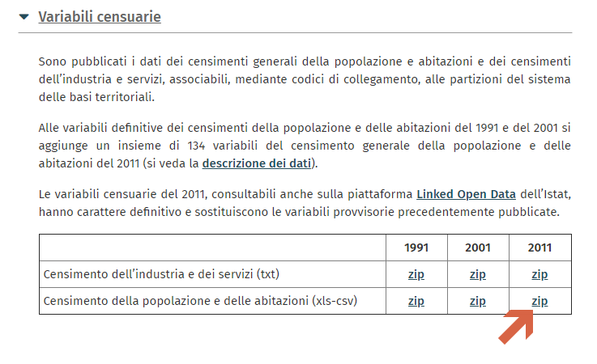
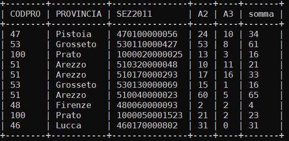
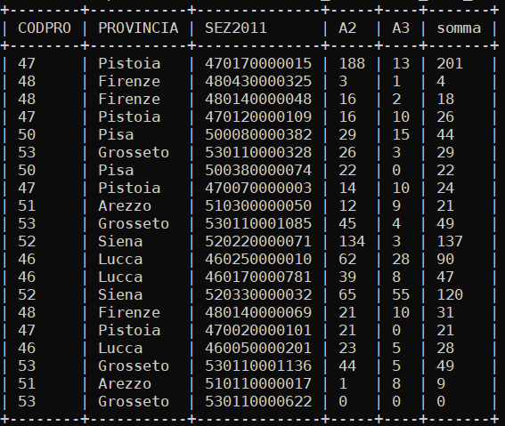

# Miller è un tool da riga di comando molto potente...

## segue un esempio semplice ma potente per estrazione di colonne da un dataset con oltre 150 colonne.

## Dataset ISTAT

Il dataset di partenza è un file CSV messo a disposizione nel sito ISTAT ([BASI TERRITORIALI E VARIABILI CENSUARIE](https://www.istat.it/it/archivio/104317)) 



## Script_01
estraggo i campi, aggiungo e popolo nuovo campo somma, infine salvo in un nuovo file

```
mlr --csv --ifs ";" cut -r -f CODPRO,PROVINCIA,SEZ2011,"^A[23]" then put '$somma=$A2+$A3' R09_indicatori_2011_sezioni.csv >R09_indicatori_2011_sezioni_sum.csv
```

## Script_02
estraggo e creo campo somma e popolo, infine visualizzo 10 righe casuali

```
mlr --c2p --barred --ifs ";" shuffle then head then cut -r -f CODPRO,PROVINCIA,SEZ2011,"^A[23]" then put '$somma=$A2+$A3' R09_indicatori_2011_sezioni.csv
```



## Script_03
estraggo e creo campo somma e popolo, infine visualizzo 20 righe casuali

```
mlr --c2p --barred --ifs ";" shuffle then head -n 20 then cut -r -f CODPRO,PROVINCIA,SEZ2011,"^A[23]" then put '$somma=$A2+$A3' R09_indicatori_2011_sezioni.csv
```

