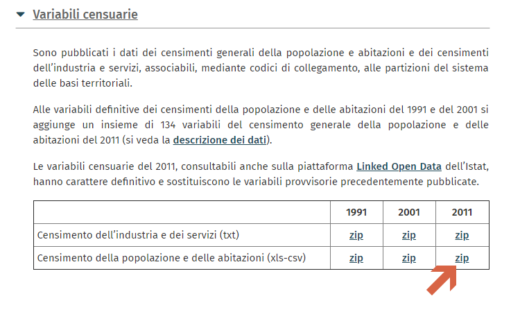

# VisiData è un tool per riga di comando molto potente ...
- repository IT: https://github.com/ondata/guidaVisiData
- repository EN: http://visidata.org/docs/


## Dataset ISTAT

Il dataset di partenza è un file CSV messo a disposizione nel sito ISTAT ([BASI TERRITORIALI E VARIABILI CENSUARIE](https://www.istat.it/it/archivio/104317)) 



## VisiData sequenza shortcuts da utilizzare

da shell Bash: `$ vd R09_indicatori_2011_sezioni.csv –csv-delimiter=”;”`


per ottenere il risultato cercato ho seguito questi passi, uno dopo l’altro (NB: Shift+c è diverso da Shift+C occhio al caps lock):

```
Shift+c — apre foglio delle colonne
s — seleziono le righe (CODPRO, PROVINCIA, SEZ2011)
|^A[23].* — selezione le righe che iniziano con A2 e A3
gt — inverto selezione
gd — cancello elementi selezionati
q — torno indietro
# — nelle colonne A2 e A3 per definirle numero Intero
=A2+A3 — creo nuovo campo ‘somma’ con espressione e popolo con la A2+A3
Shift+^ — sul campo appena creato per rinominarlo
Ctrl+s — salvo il foglio.
```

## Risultato

